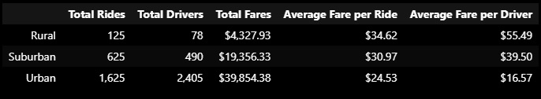
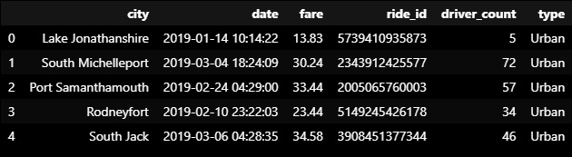
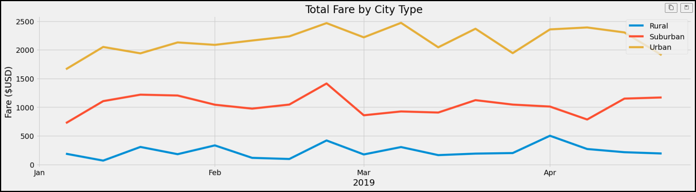

# PyBer_Analysis

## Overview of Analysis
- Creating a multiple-line graph that shows the total weekly fares for each city type
- Explain how the data differs by city type and how those differences can be used by decision-makers at PyBer.

## Purpose

We have been give a new assignment by our boss, to create a DataFrame of the ride-sharing data by city type.
Omar and I will be analyzing the data to see how each community differes in ride-sharing. 

## Analysis

Below you will some of the work we did to get to the results we wanted.

Above you can see the chart that we created after scrubbing the data and cleaning. This chart tells us
a few things.
  1. Rural and suburban areas are more expensive than urban
  2. Urban areas seems to be the area you want to be at if you want thrive in this business.
  
  

Here, we ended up merging city and ride csv files. We did this so we can use the pivot function to create
a new table and then using this new table to create the next dataframe which involved using the resample
function. The end results is this multi-line graph that you'll see below which shows us a timeline; we'll 
get more into this in the results section of this analysis.

## Results

As we look at the graph we can see exactly what was explained earlier in this analysis. That rural and suburban areas
are more expensive in fares and urban areas are heavy in use when it comes to ride-sharing. 
We can also see that the fares are not that expensive in the urban communities.

## Summary
We have a few recommendations that we were able to pull from our analysis, and we believe they can help your business
prosper.
  1. For the suburban and rural areas - Reduce the fare price if the driver is using an E-vehicle. This can make ride-sharing
 more appealing.
  2. From the graph, we are able to safely assume that ride-sharing drops during the colder seasons. Maybe incentives can be
added for using this service? Discounts to certain restaurants or entertainment are a few we can think of atm.
  3. I would recommend also changing from City Types or Community Types. City types are more like - Megacities, twin-cities, smart cities, etc. And your rural, suburbs, and rural areas are communities within the county/town/valley.

Thank you for the opportunity on this assignment. We hope we were able to offer what you were looking for.
